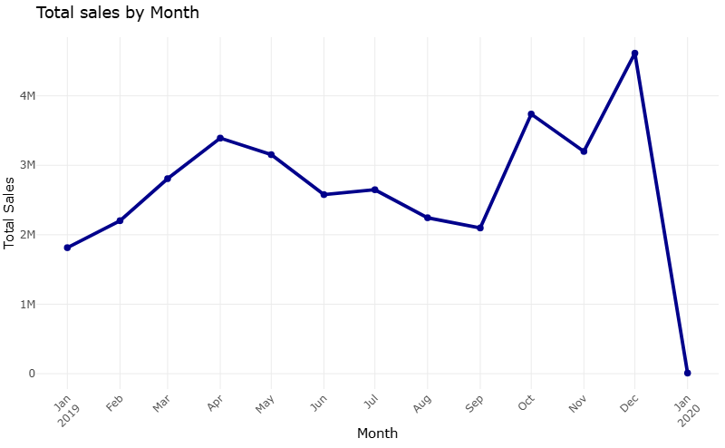
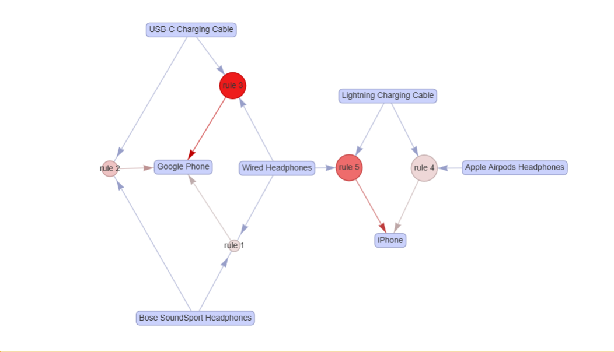

# Sales Analytics Project

## Overview
This project demonstrates a full-cycle sales data analysis, from raw data cleaning to business insights and forecasting.  
The goal is to analyze sales patterns, identify top products, segment customers, explore product associations, and forecast future sales to support business decisions.

---

## Project Scope
The analysis includes:

- Sales Trend Analysis: Visualizing overall sales and seasonality to identify peaks and trends.
- ABC Analysis: Identifying top-performing products using the Pareto principle (80/20 rule).
- Market Basket Analysis: Discovering product associations and cross-selling opportunities.
- Sales Forecasting: Predicting future sales using Prophet (forecasting performed in the HTML report).

---

## Key Insights
- Top products contribute the majority of revenue.  
- Certain products are frequently purchased together, suggesting cross-sell opportunities.  
- Sales trends reveal seasonal peaks and key periods for promotions.  
- Forecasting helps plan inventory and marketing campaigns.

---

## Tools Used
- R for all analysis  
- tidyverse for data manipulation and visualization  
- ggplot2 for charts  
- R Markdown for reproducible reporting  
- arules / arulesViz for Market Basket Analysis  
- Prophet for sales forecasting  

---

## Output / Visualization
Key visualizations included in this repository:

### Sales Trend
  

### ABC Analysis
  

### Market Basket Analysis
  

---

## Data
- Sales transaction data with order dates, products, quantities, and revenue.  
- The original dataset is not included; description is provided.

---

## Business Value
This project demonstrates how data-driven insights can inform product strategy, customer retention, cross-selling opportunities, and inventory planning.
